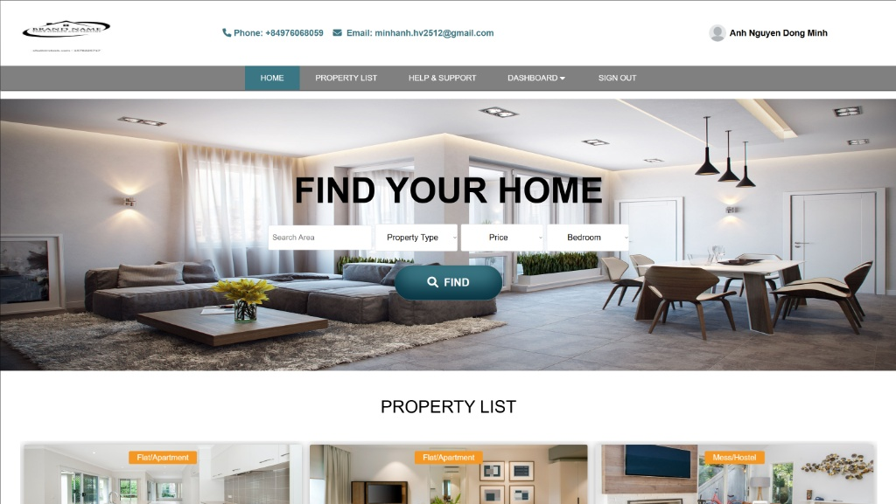

# House Rental System
  

## 📔 Mô tả (Description)
Đây là dự án website C2C cho thuê nhà/bất động sản, được xây dựng và tùy chỉnh để học tập và demo. Ứng dụng web này cung cấp các tính năng quản lý người dùng, quản lý đặt chỗ, quản lý hồ sơ và chức năng tìm kiếm bất động sản.   

## 💡 Công nghệ (Technology)
- Frontend: HTML, CSS, JavaScript
- Backend: PHP
- Database: MySQL  

## 💻 Người thực hiện (Contributor)
- <a href="https://github.com/ndmanh2005">Nguyễn Đồng Minh Anh</a>  

## 🤝 Kết nối với tôi (Stay connected)
<a target="_blank" href="https://github.com/ndmanh2005">
    
</a> &nbsp;&nbsp;&nbsp;
<a target="_blank" href="https://www.facebook.com/manhh.dm2512">
    
</a>  